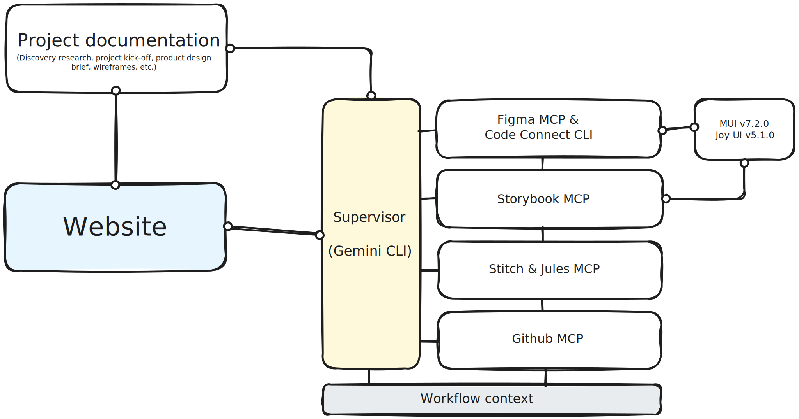

# www
www.ailsablair.com

**My portfolio website is currently under maintenance;** as I make some tweaks to how the **APIs, CLIs and MCP servers** interact with each other on the back-end. 

For access to case studies prior to _Nuclear Promise X_ go to the [old version of my www](https://ailsablairportfolio.webflow.io) (__pw__: d3sign)

## Upcoming releases
Improving the architecture to cut down on cost and maximize accuracy across my process.

### CURRENT ARCHITECTURE
   

### RELAUNCH OF www
- Creating an infrastructure of **APIs, CLIs and MCP Servers** to push www updates from _Figma_, using **No-Code AI.**
- Adhering to all necessary **compliance and security restrictions** associated with a **_Level 2 (Secret) Security Clearance_** within the Nuclear industry.
- Reduction of backend costs by **limiting the flow of information across different tools.**
- Access to new case studies documenting more current projects using **Automation, AI, Chatbot Interfaces (Internal tools) & APIs/CLIs/MCP Servers.**
- Updates to case studies from [ailsablairportfolio.](https://ailsablairportfolio.webflow.io)
- **UI updates automatically pushed** via the above infrastructure, using the **no-code approach** all hosted right here on my [public www Github repo](https://github.com/ailsablair/www)
