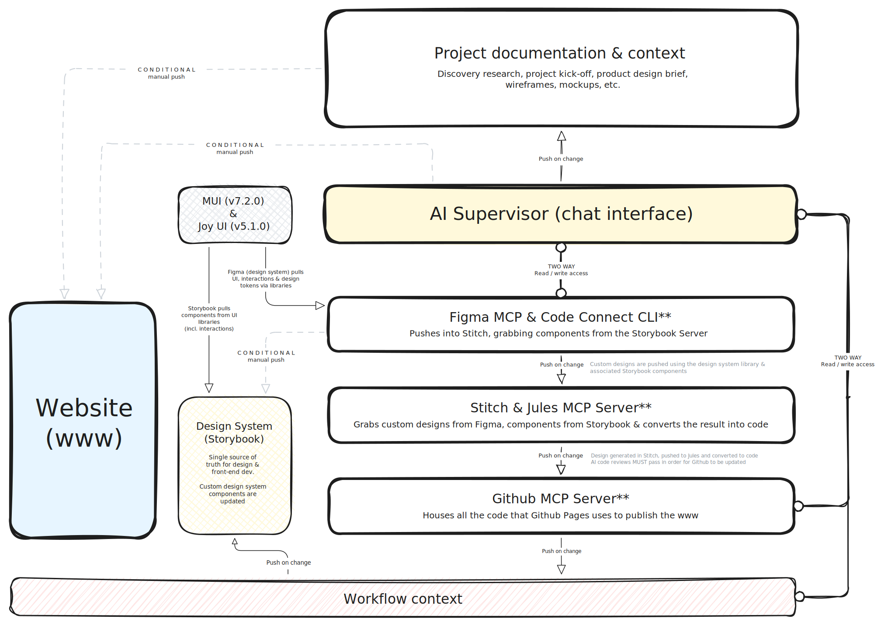

# www
www.ailsablair.com

**My portfolio website is currently under maintenance;** as I make some tweaks to how the **APIs, CLIs and MCP servers** interact with each other on the back-end. 

For access to case studies prior to _Nuclear Promise X_ go to the [old version of my www](https://ailsablairportfolio.webflow.io) (__pw__: d3sign)

## Upcoming releases
Improving the architecture to cut down on cost and maximize accuracy across my process.

#### CURRENT ARCHITECTURE
The current architecture uses Geminis CLI as the "brain" or supervisor for the flow. You'll notice that each "agent" or software integration is designed to talk to all other agents in the flow. This maximizes the accuracy of context across the flow, but comes at a price, literally. The new architecture will limit "agents" interactions with other core parts of the flow, ultimately cutting down on recurring monthly cost for my wallet 💸
 
    
 

#### PROPOSED ARCHITECTURE
**KEY UPDATES**
1. Website to only updates after manual push from Github; user _must_ review pull request(s) created by Stitch / Jules prior
2. Add limitations to how the process can interact with MUI / Joy UI - content cannot be overwritten, only needs to be pulled for new components within Storybook
3. Instead of pushing all project documentation & context through the entire process, we limit the amount of information the AI Supervisor is processing at _each_ stage, saving costs and improving efficiency
4. Limit two-way communication to key stages of the process
       4a. AI Supervisor (chat-interface) ↔︎ Figma / Code Connect CLI 
       4b. AI Supervisor (chat-interface) ↔︎ Worflow Context
       4c. AI Supervisor (chat-interface) ↔︎ Github MCP Server
       4d. Figma / Code Connect CLI ↔︎ Custom Design System (Storybook)
9. Push updates only - limit how much data we process at each stage of the process
 
    
 
** Awaiting further iteration; Hypothesis: More efficiencies & savings can be made by leveraging part of an API instead
      

#### RELAUNCH OF www
- Creating an infrastructure of **APIs, CLIs and MCP Servers** to push www updates from _Figma_, using **No-Code AI.**
- Adhering to all necessary **compliance and security restrictions** associated with a **_Level 2 (Secret) Security Clearance_** within the Nuclear industry.
- Reduction of backend costs by **limiting the flow of information across different tools.**
- Access to new case studies documenting more current projects using **Automation, AI, Chatbot Interfaces (Internal tools) & APIs/CLIs/MCP Servers.**
- Updates to case studies from [ailsablairportfolio.](https://ailsablairportfolio.webflow.io)
- **UI updates automatically pushed** via the above infrastructure, using the **no-code approach** all hosted right here on my [public www Github repo](https://github.com/ailsablair/www)
- Leveraging OLX Engineering's learnings of [using generative AI to extract job roles from job ads](https://tech.olx.com/extracting-job-roles-in-job-ads-a-journey-with-generative-ai-e8b8cf399659)
- Evaluating a Retrieval Augmented Generation (RAG)-based LLM system (question-answer) vs. Cache-Augmented Generation (CAG) and Knowledge-Augmented Generation (KAG) systems - especially as the data expands
